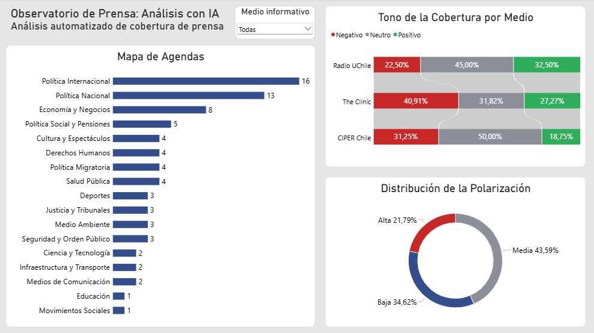
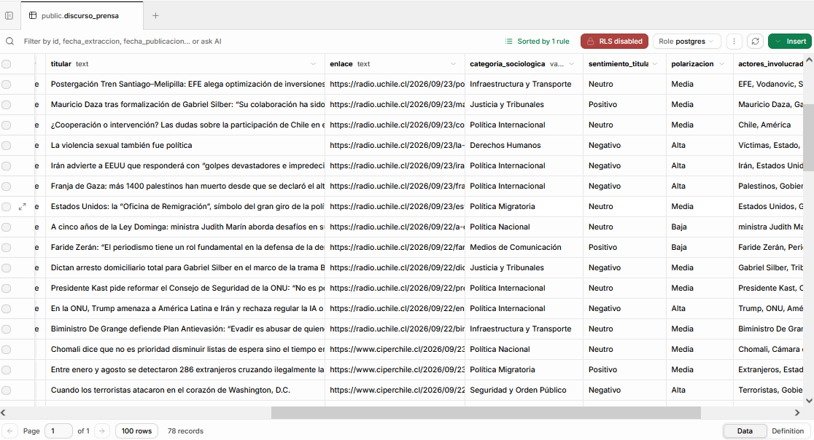

# Observatorio de Prensa: Análisis de Agenda Setting y Framing con IA

Pipeline de datos **end-to-end y serverless** que extrae titulares de medios independientes chilenos, los clasifica con Inteligencia Artificial generativa y los visualiza en un dashboard interactivo para estudiar la **agenda mediática (Agenda Setting)** y el **encuadre (Framing)** del debate público.

Todo funciona de forma automática y desatendida: la ejecución (GitHub Actions), el almacenamiento (Supabase) y el procesamiento de lenguaje (Gemini API) se levantan bajo demanda en la nube, sin servidores propios que administrar.

---

## Contexto y objetivo

El *Agenda Setting* plantea que los medios influyen en **de qué se habla**; el *Framing* estudia **cómo se habla** de ello (tono, encuadre, nivel de conflicto). Analizarlo a mano es lento y difícil de sostener en el tiempo.

Este proyecto lo automatiza: cada día captura los titulares de tres medios y los transforma en variables estructuradas para responder:

> *¿Qué temas instalan los medios independientes chilenos, con qué tono los abordan y qué tan polarizado es el debate resultante?*

---

## Arquitectura del proyecto

**Flujo general:**

`GitHub Actions (cron diario)` → `Extracción RSS` → `Clasificación con Gemini` → `PostgreSQL (Supabase)` → `Power BI`

**Las cinco fases:**

1. **Orquestación (GitHub Actions):** un *cron job* diario ejecuta el pipeline en la nube. Las credenciales (clave de API y base de datos) se inyectan mediante **GitHub Secrets**, sin exponerse en el código público.
2. **Extracción (Python):** lectura de los feeds RSS de **Radio UChile, CIPER Chile y The Clinic** con `feedparser`.
3. **Transformación NLP (Gemini 3.5 Flash-Lite):** cada titular se procesa con un *prompt* restrictivo que devuelve tres variables:
   - **Categoría sociológica** (taxonomía cerrada de 18 temas)
   - **Sentimiento** (positivo, negativo o neutro)
   - **Nivel de polarización**
4. **Carga (Supabase · PostgreSQL):** almacenamiento relacional en la nube con lógica de idempotencia (`ON CONFLICT DO NOTHING`) para no duplicar registros.
5. **Visualización (Power BI):** conexión directa a la base de datos (*Connection Pooler*, puerto 6543) para el dashboard de Agenda Setting y Framing.

---

## Visualización de datos: preguntas que responde el dashboard (Demo)

- **Mapa de Agendas:** *¿Qué temas concentran la cobertura?* Barras horizontales con el volumen de noticias por categoría.
- **Tono de la Cobertura por Medio:** *¿Con qué tono aborda cada medio la información?* Barras apiladas que cruzan el medio con el sentimiento del titular.
- **Distribución de la Polarización:** *¿Qué nivel de polarización presenta el conjunto analizado?* Distribución porcentual del nivel de polarización del debate.


### Dashboard analítico en Power BI



### Base de datos estructurada


---

## Stack tecnológico

- **Lenguaje:** Python 3.x
- **Procesamiento IA:** Google Gemini API (`gemini-3.5-flash-lite`, capa gratuita)
- **Base de datos:** PostgreSQL en Supabase
- **Orquestación y CI/CD:** GitHub Actions
- **Visualización:** Microsoft Power BI
- **Librerías principales:** `feedparser`, `psycopg2-binary`, `google-generativeai`, `python-dotenv`

---

## Desafíos técnicos y soluciones (Troubleshooting)

### 1. Fragmentación semántica de la IA (alucinación)
- **Problema:** al pedir una "categoría sociológica" libre, el LLM generó **33 categorías** redundantes (ej. "Política Pública", "Políticas Públicas", "Política y Justicia"), lo que arruinaba el análisis.
- **Solución:** **Prompt Engineering restrictivo**: una taxonomía cerrada de **18 categorías** de la que el modelo debe elegir obligatoriamente, más `temperature=0.2` para que se comporte como un clasificador consistente. Se vació la tabla con `TRUNCATE` (sin destruir su estructura) y se reprocesó todo con el nuevo criterio.

### 2. Límites de cuota de API (HTTP 429)
- **Problema:** el script superaba el límite de la capa gratuita de Gemini (**15 peticiones por minuto**) y devolvía `429 RESOURCE_EXHAUSTED`.
- **Solución:** pausa de seguridad (`time.sleep(5)`) tras cada llamada y dentro del bloque `try/except`. Se sacrifica algo de velocidad a favor de la estabilidad del pipeline.

### 3. Conexión de Power BI a PostgreSQL en la nube
- **Problema:** Power BI bloqueaba la descarga de datos por un error de validación de certificado SSL.
- **Solución:** se usó el **Connection Pooler** (puerto `6543`, IPv4) en lugar del puerto tradicional (`5432`) y se reconfiguró el origen de datos en Power BI para no exigir el cifrado forzado.
- **Nota:** solución pragmática para un portafolio con datos públicos. En producción conviene mantener el cifrado activo y validar el certificado CA de Supabase.

### 4. Gestión segura de credenciales
- **Problema:** el repositorio es público pero el pipeline necesita claves.
- **Solución:** `SUPABASE_URL` y `GEMINI_API_KEY` viven en **GitHub Secrets** y se inyectan solo durante la ejecución; en local se usa un `.env` excluido del control de versiones.

---

## Idempotencia y eficiencia

Un proceso es **idempotente** si puede ejecutarse una o mil veces y el resultado final en la base de datos es el mismo, sin duplicados.

- La columna `enlace` es `UNIQUE` en PostgreSQL y las inserciones usan `ON CONFLICT DO NOTHING`.
- **Antes** de llamar a la IA (que consume cuota y tiempo), el pipeline compara los enlaces del RSS con los ya guardados y procesa solo las noticias estrictamente nuevas.
- Si el pipeline se cae o corre dos veces el mismo día, no hay duplicados ni cuota desperdiciada.

---

## Cómo reproducir el proyecto

```bash
git clone https://github.com/CristianRiquelmeF/<nombre-del-repositorio>.git
cd <nombre-del-repositorio>
pip install feedparser psycopg2-binary google-generativeai python-dotenv
```

Crea un archivo `.env` (no versionado):

```env
SUPABASE_URL=<cadena de conexión del Connection Pooler>
GEMINI_API_KEY=<tu_api_key>
```

Ejecuta localmente con `python main.py`. Para automatizarlo, guarda ambas variables en *Settings → Secrets and variables → Actions* y programa un workflow con `schedule` (cron) que instale las dependencias y ejecute el script.

---

## Limitaciones y mejoras futuras

- Se clasifican **titulares**, no el cuerpo completo de la nota.
- La clasificación del LLM no está contrastada con codificación humana; una mejora sería etiquetar una muestra y medir la concordancia (ej. Cohen's Kappa).
- Cobertura limitada a tres medios independientes.
- Reemplazar la pausa fija por reintentos con *exponential backoff* y agregar alertas ante fallos del workflow.

---

## Homologación: adaptar la arquitectura a otras preguntas de investigación

La arquitectura es **agnóstica al tema**. En esencia hace esto:

> **Recolectar texto de una fuente → clasificarlo con un esquema cerrado mediante un LLM → guardarlo de forma idempotente → visualizarlo.**

Cualquier pregunta que se pueda expresar como *"texto de entrada → variables categóricas de salida"* puede reutilizar el mismo esqueleto.

### Qué cambia y qué se mantiene

**Cambia:**
- **La fuente de datos:** otro RSS, una API, scraping, un CSV o una exportación de plataforma.
- **La taxonomía y el prompt:** nuevas variables y categorías acordes a la pregunta.
- **Las columnas de la tabla y el dashboard.**

**Se mantiene:**
- La **idempotencia** (`UNIQUE` + `ON CONFLICT DO NOTHING`), eligiendo solo el identificador único adecuado.
- El **control de cuota** y el manejo de errores (`try/except`).
- La **orquestación** con GitHub Actions y la gestión de secretos.

### Ejemplos con la misma base

- **Reclamos ciudadanos** (OIRS, municipios): tema, urgencia y unidad responsable. Identificador: ID del reclamo.
- **Encuadre de un tema específico** (migración, seguridad, educación) en prensa: encuadre y tono. Identificador: URL.
- **Encuestas de satisfacción abiertas:** dimensión evaluada, sentimiento y sugerencia. Identificador: ID de respuesta.
- **Debate legislativo:** tema, postura y actor. Identificador: sesión + intervención.
- **Comentarios o reseñas públicas** sobre un programa: aspecto valorado y sentimiento. Identificador: ID del comentario.

### Pasos para adaptarlo

1. **Formular la pregunta** y traducirla a variables observables (tema, tono, actor, encuadre).
2. **Diseñar la taxonomía cerrada:** categorías mutuamente excluyentes, con una opción "Otros". Es el paso que más impacta la calidad, como ocurrió al pasar de 33 categorías libres a 18 controladas.
3. **Reescribir el prompt** con esa lista, un formato de salida exacto (idealmente JSON) y `temperature` baja.
4. **Cambiar el módulo de extracción** y definir el identificador único.
5. **Ajustar el esquema SQL** y rediseñar el dashboard.
6. **Validar con una muestra codificada a mano** (100–200 registros) antes de escalar, y corregir el prompt si la concordancia es baja.

### Consideraciones

- **Datos personales:** si la fuente incluye información de personas, anonimizar antes de enviar el texto a una API externa.
- **Cuotas:** la capa gratuita sirve para volúmenes pequeños; con más volumen conviene procesar por lotes o usar un plan de pago.
- **Comparabilidad:** si cambias la taxonomía o el modelo, reprocesa el histórico completo para no mezclar criterios.

---


**Proyecto independiente desarrollado por Cristian Riquelme** para su portafolio profesional de Data Engineering y Análisis de Datos. Demuestra el diseño e implementación de una solución completa: extracción web, modelamiento de bases de datos, uso aplicado de APIs de IA, automatización con CI/CD y Business Intelligence, articulados con una pregunta de investigación de las ciencias sociales.

🔗 [LinkedIn](https://linkedin.com/in/cristianriquelmef) · [GitHub](https://github.com/CristianRiquelmeF) · [Portafolio](https://cristianriquelmef.github.io)